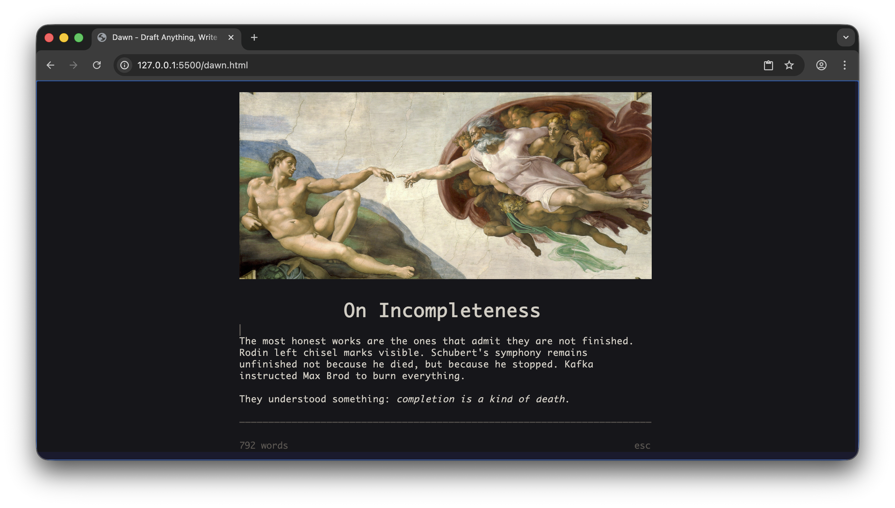
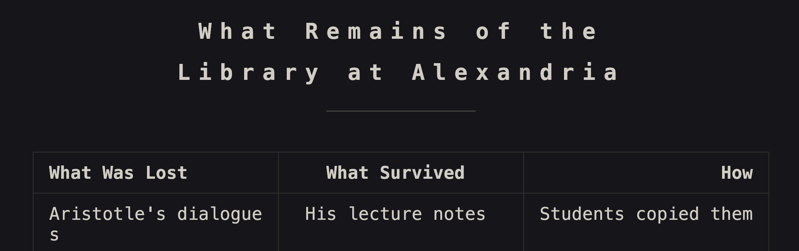
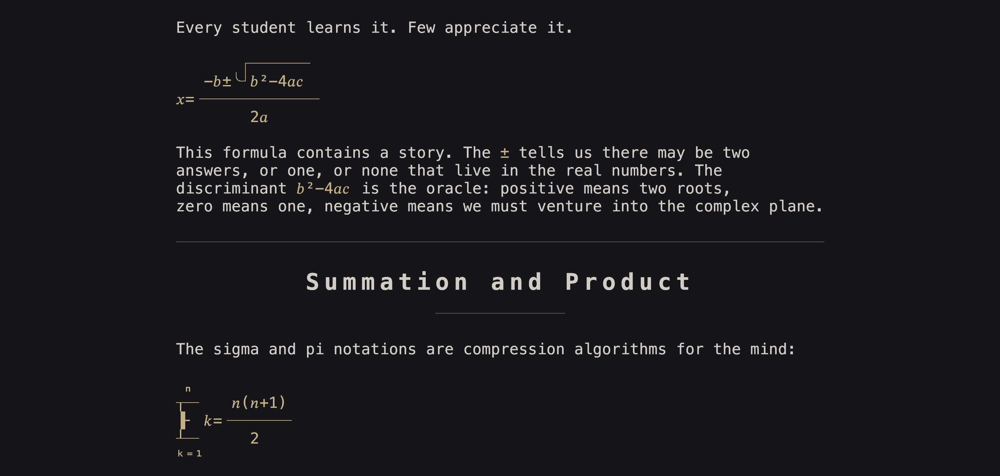
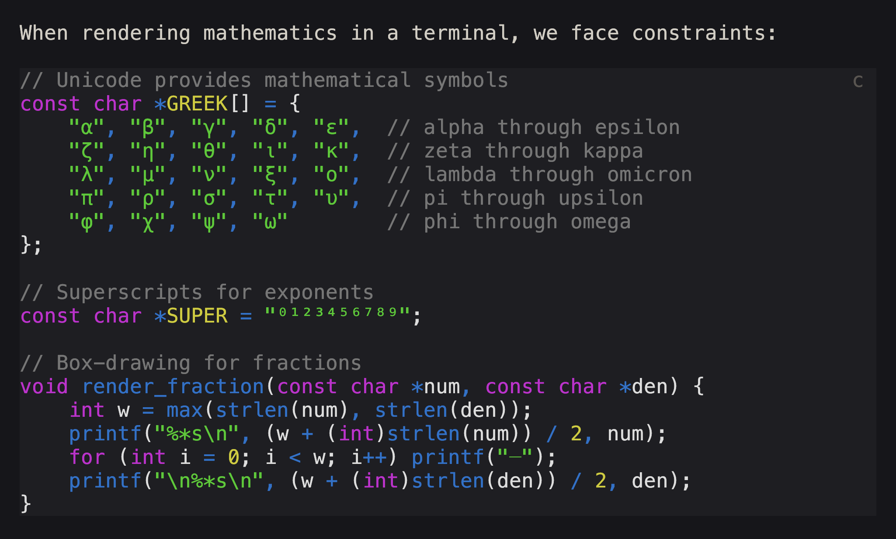
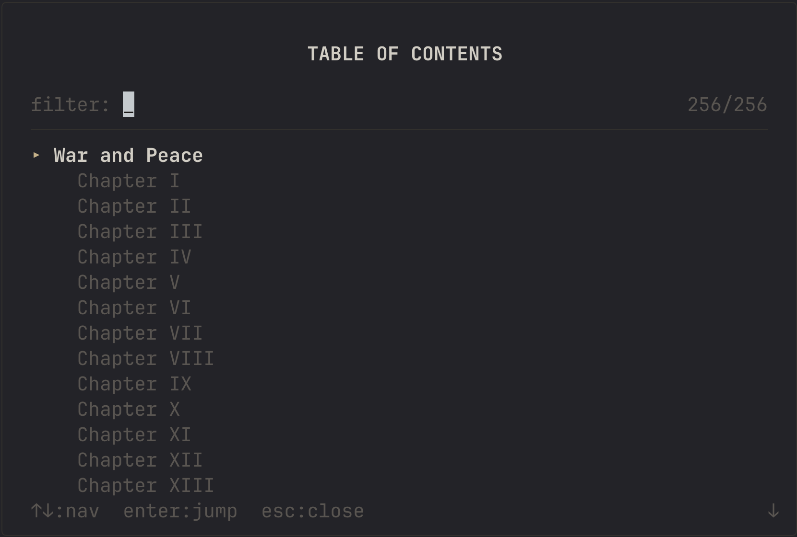
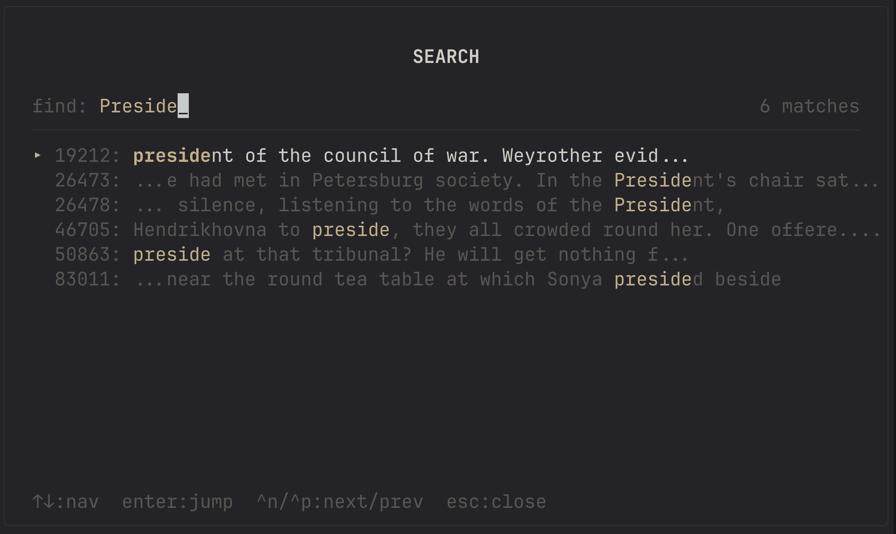
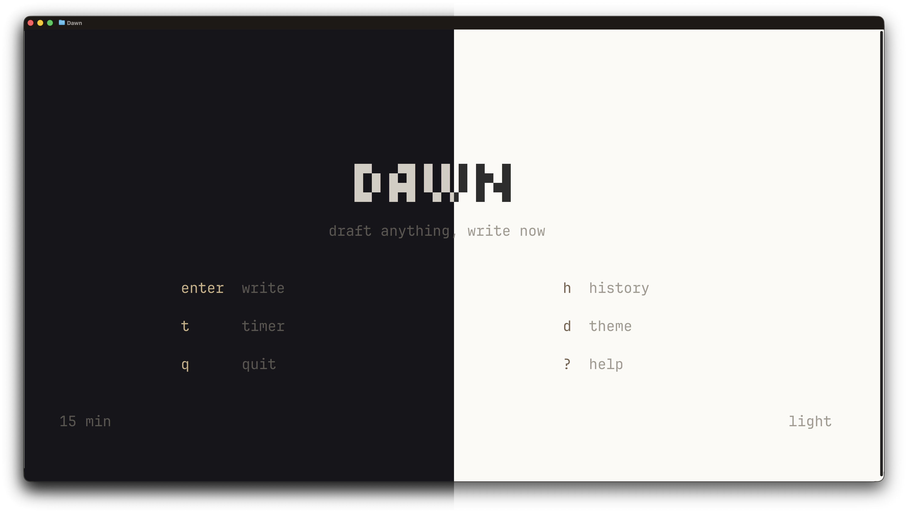

<picture>
  <source media="(prefers-color-scheme: dark)" srcset="./assets/atlantis.svg" />
  
</picture>

<div align="center">
  <h1>atlantis</h1>
  <h3>Navigate Your Thoughts.<br/><br/>A calm, navigation-first markdown editor for deep work.</h3>

  <a href="https://github.com/adsnunes/atlantis/blob/main/LICENSE">
    
  </a>
  <a href="https://github.com/adsnunes/atlantis/releases">
    
  </a>
  <br />
  <a href="https://twitter.com/andrewmd5">
    
  </a>
</div>

---

## What is this?

Atlantis is a lightweight document drafter that runs in your terminal. It renders markdown as you type: headers scale up, math becomes Unicode art, images appear inline. No electron, no browser, no network required.

Atlantis is designed for low-latency, distraction-free writing. It keeps Dawn's fast markdown editor core, but makes moving around a document the primary interaction: one filtered quick-open view, hierarchy-aware headings, and predictable keyboard navigation.

---

## Portability

Atlantis separates the engine from the platform layer. The core handles text editing, markdown parsing, and rendering. The platform layer (`platform.h`) provides I/O, making it straightforward to port to different environments.

Current targets:
- **Terminal** (primary) - POSIX terminals with optional Kitty graphics/text sizing
- **Web** (experimental) - Canvas-based rendering via Emscripten

The architecture makes adding new frontends relatively simple. Implement the platform API, and the engine handles everything else.

```
+---------------------------------------------+
|              Frontend                       |
+---------------------------------------------+
|              platform.h API                 |
+---------------------------------------------+
|  atlantis.c  |  atlantis_md  |  atlantis_tex  |  ...   |
|          +-----------+------------+         |
|              Gap Buffer (text)              |
+---------------------------------------------+
```



---

## Features

### Live Markdown Rendering

Markdown renders as you write. Headers grow large. Bold becomes **bold**. Code gets highlighted. The syntax characters hide when you're not editing them.

**Supported syntax:**
- Headers (H1-H6) with proportional scaling on compatible terminals
- **Bold**, *italic*, ~~strikethrough~~, ==highlight==, `inline code`
- Blockquotes with nesting
- Ordered and unordered lists with task items (`- [ ]` / `- [x]`)
- Horizontal rules
- Links and autolinks
- Footnotes with jump-to-definition (`Ctrl+N`)
- Emoji shortcodes (`:wave:`)
- Smart typography (curly quotes, em-dashes, ellipses)

---

### Tables

Pipe-delimited tables with column alignment, rendered with Unicode box-drawing:



---

### Mathematics

LaTeX math expressions render as Unicode art directly in your terminal. Both inline `$x^2$` and display-mode `$$` blocks are supported.



Supported: fractions, square roots, subscripts, superscripts, summations, products, limits, matrices, Greek letters, accents, and font styles (`\mathbf`, `\mathcal`, `\mathbb`, etc.).

---

### Syntax Highlighting

Fenced code blocks display with language-aware syntax highlighting for 35+ languages.



---

### Writing Timer

Optional timed writing sessions to encourage flow. Select 5-30 minutes (or unlimited), then write until the timer completes. Auto-saves every 5 seconds.

- `Ctrl+P` - pause/resume timer
- `Ctrl+T` - add 5 minutes

---

### Focus Mode

Press `Ctrl+F` to hide all UI (status bar, word count, timer) leaving only your text (and disabling deletions)

---

### Navigation-first workflow

Atlantis is built around getting to the right place quickly instead of memorizing editor modes.

- **Quick Open** (`Ctrl+L`) - Type a few characters to fuzzy-filter every heading, then press `Enter` to jump
- **Search** (`Ctrl+S`) - Find text with context preview and jump directly to a result
- **Footnotes** (`Ctrl+N`) - Jump between a reference and its definition
- **Arrow keys** - Move by visual lines while preserving the target column
- **Alt/Ctrl + ←/→** - Move by words
- **Escape** - Return to the document from any navigation view





---

### Themes

Light and dark color schemes that adapt to your terminal's capabilities.



---

### AI Chat (Experimental)

An optional AI assistant panel is available (`Ctrl+/`). Useful for asking questions or searching. Uses Apple foundational models.


---

## Installation

### Homebrew (macOS/Linux)

After the first tagged release, install Atlantis exactly like Dawn:

```bash
brew tap adsnunes/tap
brew install atlantis
```

The release workflow publishes macOS ARM64/x64 and Linux ARM64/x64 archives, calculates their checksums, and updates the tap formula automatically.

### PowerShell (Windows)

```powershell
irm https://raw.githubusercontent.com/adsnunes/atlantis/main/install.ps1 | iex
```

The installer detects x64/ARM64, downloads the latest release, and adds `atlantis` to your user PATH.

### From Releases

Download a prebuilt binary from [Releases](https://github.com/adsnunes/atlantis/releases).

### Install from source

```bash
make
make PREFIX="$HOME/.local" install
```

This installs `atlantis` into `~/.local/bin`.

### From Source (macOS/Linux)

```bash
git clone --recursive https://github.com/adsnunes/atlantis.git
cd atlantis
make
make install  # optional, installs to /usr/local/bin
```

To install under a different prefix, pass `PREFIX` on the install
invocation (the variable is consumed by `cmake --install`, not the
build itself):

```bash
make PREFIX=/usr/local/atlantis-0.1.3 install
```

**Requirements:**
- CMake 3.16+
- C compiler with C23 support (Clang 16+, GCC 13+)
- libcurl

**Build targets:**
- `make` - Build with debug info
- `make release` - Optimized build
- `make debug` - Debug build with sanitizers
- `make web` - WebAssembly build (requires Emscripten)
- `make with-ai` - Build with Apple Intelligence (macOS 26+)

### From Source (Windows)

```powershell
git clone --recursive https://github.com/adsnunes/atlantis.git
cd atlantis
cmake -S . -B build -G "Visual Studio 18 2026" -A ARM64  # or -A x64 for Intel/AMD
cmake --build build --config Release
```

The executable will be at `build/Release/atlantis.exe`.

**Requirements:**
- CMake 3.16+
- Visual Studio 2026 (or newer) with C++ workload

---

## Usage

```bash
# Start a new writing session
atlantis

# Open an existing file for editing
atlantis document.md

# Preview (read-only)
atlantis -p document.md

# Print rendered output to stdout
atlantis -P document.md
cat document.md | atlantis -P
```

---

## Keyboard Reference

| Key | Action |
|:----|:-------|
| `Ctrl+F` | Toggle focus mode |
| `Ctrl+R` | Toggle plain text (raw markdown) |
| `Ctrl+L` | Quick Open (fuzzy heading navigation) |
| `Ctrl+S` | Search |
| `Ctrl+N` | Jump to/create footnote |
| `Ctrl+G` | Edit image dimensions |
| `Ctrl+E` | Edit document title |
| `Ctrl+Z` | Undo |
| `Ctrl+Y` | Redo |
| `Ctrl+H` | Show all shortcuts |
| `Esc` | Close panel/modal |

---

## File Format

Documents are saved as standard markdown with optional YAML frontmatter:

```yaml
---
title: My Document
date: 2025-01-15
---

Your markdown content here.
```

---

## License

MIT