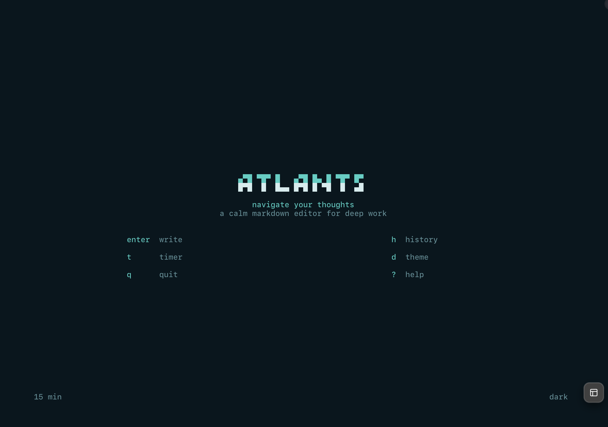
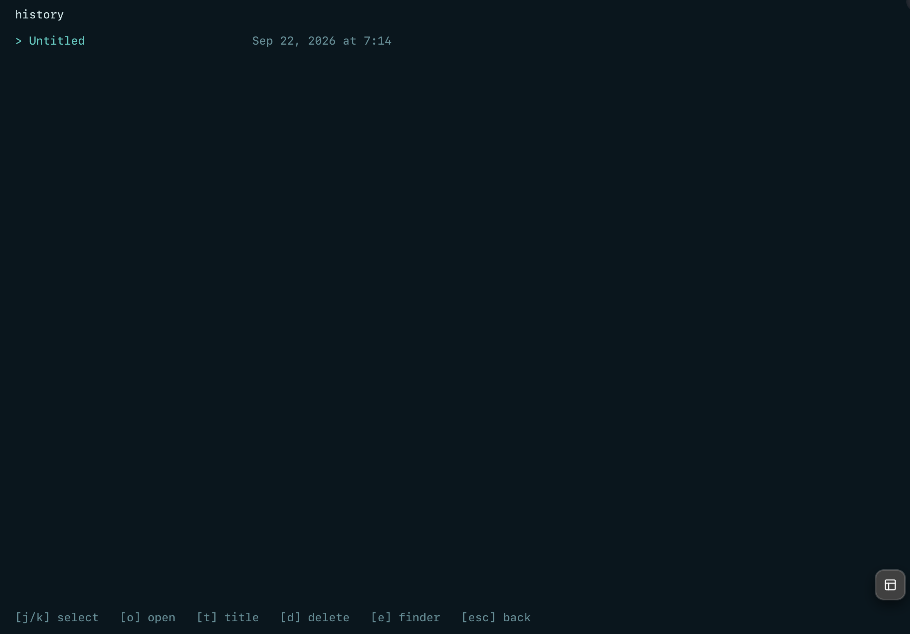
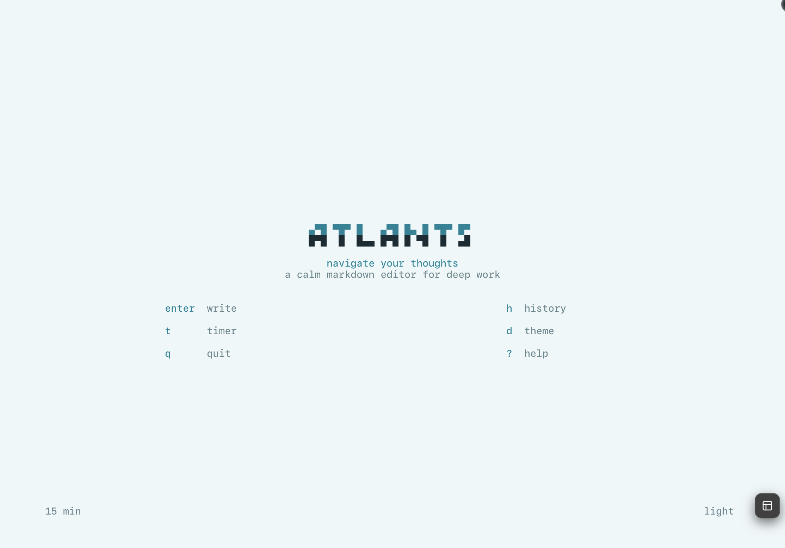

# Atlantis

<p align="center">
  
</p>

<p align="center">
  <strong>A calm, navigation-first Markdown editor for the terminal.</strong>
</p>

Atlantis is a fast, distraction-free writing environment for people who want to move through long documents without memorising a complex editor. It renders Markdown as you type and keeps navigation close at hand.

## Why Atlantis?

- **Quick Open** — press `Ctrl+L`, type part of a heading, and jump to it.
- **Hierarchy-aware navigation** — headings retain their document structure.
- **Search that lands you in context** — `Ctrl+S` previews matches before jumping.
- **Keyboard-first movement** — visual lines, words, pages, and footnotes have predictable shortcuts.
- **Local and fast** — no browser, Electron app, account, or network connection is required.

## Screenshots

These are real captures from Atlantis running locally.

### Welcome screen



### History



### Writing timer



## Features

### Live Markdown

Atlantis renders the document while you write:

- Headings with visual hierarchy
- Bold, italic, underline, strikethrough, highlights, and inline code
- Ordered, unordered, and task lists
- Blockquotes and horizontal rules
- Links and autolinks
- Footnotes
- Emoji shortcodes
- Smart typography

### Rich terminal rendering

- Tables with aligned Unicode borders
- LaTeX math rendered as terminal-friendly Unicode
- Syntax highlighting for common programming languages
- Inline images on terminals that support graphics
- Light and dark ocean-inspired themes

### Focused writing

- Optional writing timer
- Focus mode with `Ctrl+F`
- Autosave and document history
- Undo and redo
- Standard Markdown files with optional YAML frontmatter

## Navigation

| Key | Action |
|:----|:-------|
| `Ctrl+L` | Quick Open: fuzzy-filter headings and jump |
| `Ctrl+S` | Search document text |
| `Ctrl+N` | Follow or create a footnote |
| `↑` / `↓` | Move by visual lines |
| `Alt`/`Ctrl` + `←` / `→` | Move by words |
| `Page Up` / `Page Down` | Scroll by page |
| `Esc` | Close the current panel or modal |

## Editing shortcuts

| Key | Action |
|:----|:-------|
| `Ctrl+F` | Toggle focus mode |
| `Ctrl+R` | Toggle raw Markdown |
| `Ctrl+Z` / `Ctrl+Y` | Undo / redo |
| `Ctrl+C` / `Ctrl+X` / `Ctrl+V` | Copy / cut / paste |
| `Ctrl+H` | Show all shortcuts |
| `Tab` / `Shift+Tab` | Indent or unindent list items |

## Installation

### Homebrew

```bash
brew tap adsnunes/tap
brew install atlantis
```

### Windows PowerShell

```powershell
irm https://raw.githubusercontent.com/adsnunes/atlantis/main/install.ps1 | iex
```

### Download a release

Prebuilt binaries for macOS, Linux, and Windows are available on the [Releases page](https://github.com/adsnunes/atlantis/releases).

### Build from source

```bash
git clone --recursive https://github.com/adsnunes/atlantis.git
cd atlantis
make
make PREFIX="$HOME/.local" install
```

The executable is installed as `~/.local/bin/atlantis`.

## Usage

```bash
atlantis                         # new document
atlantis notes.md                 # edit a Markdown file
atlantis -p notes.md              # read-only preview
atlantis -P notes.md              # print rendered output
cat notes.md | atlantis -P       # render stdin
```

## Requirements

- macOS, Linux, or Windows
- CMake 3.16+
- C compiler with C23 support (Clang 16+ or GCC 13+)
- libcurl on macOS/Linux

## Development

```bash
make          # build with debug information
make release  # optimized build
make debug    # debug build with sanitizers
make clean
```

Run the parser tests with:

```bash
./build/test-block
```

## License

MIT
